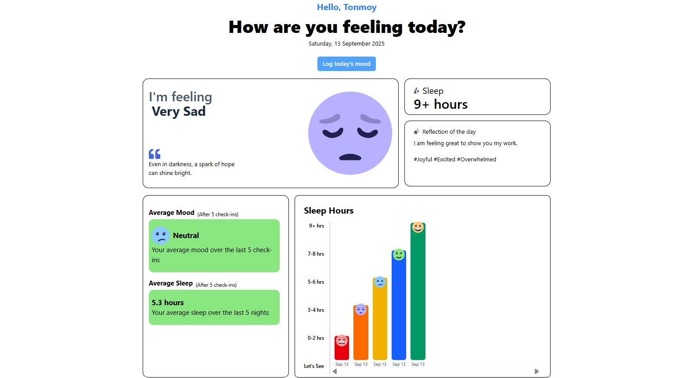

# Mood Tracking App 🌟

A beautiful and intuitive web application for tracking your daily mood, sleep patterns, and emotional well-being.



## Features

- **User Authentication**: Secure registration and login system
- **Mood Tracking**: Log your daily mood with 5 different emotional states
- **Sleep Monitoring**: Track your sleep hours and view historical data
- **Emotional Tagging**: Add up to 3 emotional tags to describe your feelings
- **Daily Reflections**: Write short reflections about your day (150 characters max)
- **Visual Analytics**: Interactive charts showing sleep patterns over time
- **Profile Management**: Customizable profile with photo upload capability
- **Responsive Design**: Works seamlessly on desktop and mobile devices

## Mood States

- 😊 Very Happy
- 🙂 Happy  
- 😐 Neutral
- 😔 Sad
- 😢 Very Sad

## Sleep Categories

- 9+ hours (Excellent)
- 7-8 hours (Good)
- 5-6 hours (Fair)
- 3-4 hours (Poor)
- 0-2 hours (Very Poor)

## Technology Stack

- **Frontend**: HTML5, CSS3, JavaScript (ES6+)
- **Styling**: Tailwind CSS
- **Icons**: Custom SVG icons
- **Build Tool**: Tailwind CSS CLI
- **Deployment**: GitHub Pages

## Installation

1. Clone the repository:
```bash
git clone <my-repository-url >
cd mood-tracking-app
npm install
npx tailwindcss -i ./src/input.css -o ./src/output.css --watch

Open index.html in your browser or use a local server.

Usages

Registration: Create a new account with email and password validation

Profile Setup: Add your name and upload a profile picture

Mood Logging: Click "Log today's mood" to start tracking

Select Mood: Choose how you're feeling from the 5 options

Add Tags: Select up to 3 emotional tags that describe your state

Write Reflection: Share a brief thought about your day

Sleep Tracking: Record how many hours you slept

View Analytics: Check your mood and sleep trends over time


## File Structure

mood-tracking-app/
├── index.html          # Main HTML file
├── formula.js          # JavaScript functionality
├── moods.json          # Mood quotes and data
├── utility.css         # Additional CSS styles
├── src/
│   └── output.css      # Compiled Tailwind CSS
├── images/             # App icons and assets
├── package.json        # Project dependencies
└── README.md          # This file

Deployment
The app can be deployed to GitHub Pages using:
npm run deploy

Browser Support

Chrome (recommended)
Firefox
Safari
Edge

Acknowledgments


Icons designed for enhanced user experience
Tailwind CSS for responsive styling
Inspiration from mental health and wellness apps